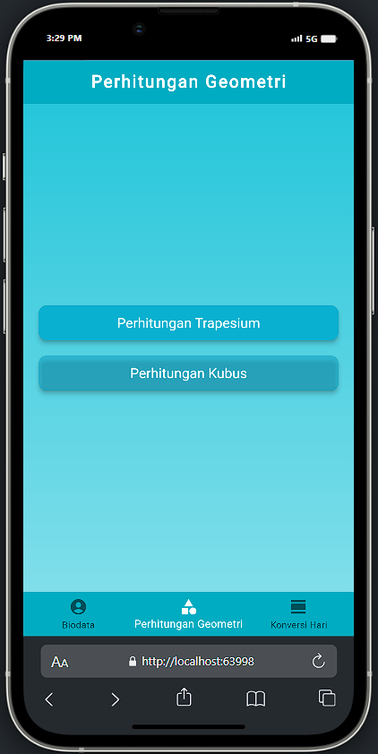

# Quiz Essay

- Muhammad Abdanul Ikhlas - 123210009

## Deskripsi
Aplikasi mobile sederhana yang terdiri dari beberapa menu dan fitur. Berikut adalah detailnya:

- **Menu Biodata**
- **Menu Perhitungan Trapesium :** Menghitung luas dan keliling trapesium
- **Menu Perhitungan Kubus     :**  Menghitung Volume dan keliling trapesium
- **Menu Konversi Hari         :**  Menghitung Volume dan keliling trapesium

  <h1>Tampilan</h1>

  &nbsp;
  &nbsp;
  &nbsp;
  &nbsp;
  

